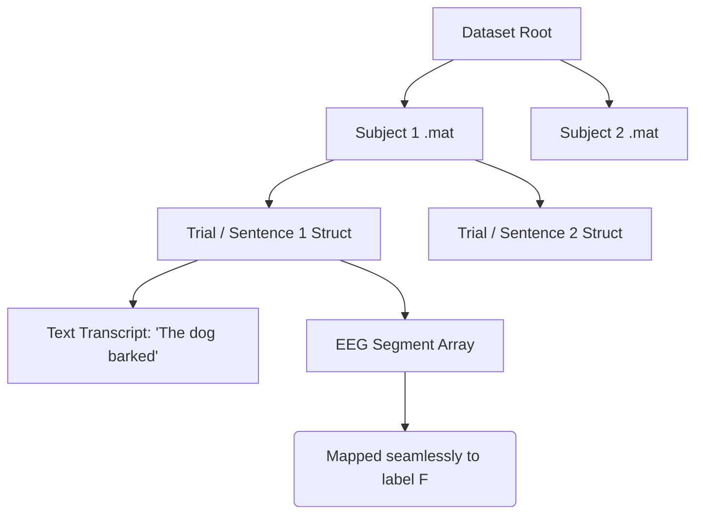

# EEG-to-Text and Speech Decoding Datasets

This document provides a comprehensive list of publicly available EEG datasets suitable for translating brain waves into text, mapping EEG to transcripts, and decoding speech.

## Dataset Summary Table

| Dataset             | Modality        | Paradigm         | Format                   | Link                                                                  |
| ------------------- | --------------- | ---------------- | ------------------------ | --------------------------------------------------------------------- |
| **ZuCo 1.0 & 2.0**  | Natural Reading | Text/Sentence    | `.mat` (Structs)         | [ZuCo 1.0](https://osf.io/q3zws/) / [ZuCo 2.0](https://osf.io/2urht/) |
| **JapanEEG**        | Overt Speech    | Continuous 1000h | BIDS (`.set` + `.tsv`)   | [ds007808](https://openneuro.org/datasets/ds007808)                   |
| **Moreira et al.**  | Auditory Speech | Phoneme/Word     | BIDS (`.set` + `.tsv`)   | [ds006104](https://openneuro.org/datasets/ds006104)                   |
| **Kara-One**        | Imagined Speech | Phoneme/Word     | `.mat` / `.npy` (Trials) | [Kara-One](http://individual.utoronto.ca/mrezazad/KaraOne/)           |
| **Simanova et al.** | Semantic Tasks  | Words/Pictures   | `.mat` (FieldTrip)       | [MPI Archive](https://hdl.handle.net/1839/00-0000-0000-0014-1C04-2)   |

---

## Data Structures and Mapping Paradigms (Graphs)

There are two primary ways these datasets map EEG signals to text transcripts.

### Paradigm A: Continuous EEG with Event Markers (BIDS Format)

Used by **JapanEEG** and **Moreira et al.**

```mermaid
gantt
    title BIDS Format: Mapping Continuous EEG to Transcripts
    dateFormat X
    axisFormat %s

    section EEG Stream
    Continuous Graph : active, 0, 10

    section events.tsv
    "apple" (Word Onset) : milestone, 2, 0
    "banana" (Word Onset) : milestone, 6, 0

    section Extracted Data
    Segment -> "apple" : 2, 4
    Segment -> "banana" : 6, 8
```

_(Continuous time-series files like `.edf` or `.set` are sliced using millisecond timestamps from a tabular `events.tsv` file containing the text transcripts)._

### Paradigm B: Pre-Segmented / Trial-Based Structs

Used by **ZuCo**, **Kara-One**, and **Simanova et al.**

_(The EEG time-series arrays are already sliced into discrete trials or sentences inside cell arrays or Python dictionaries. The textual label is directly attached to the struct containing the EEG segment)._

---

## Detailed Dataset Breakdown

### 1. ZuCo 1.0 & 2.0 (Zurich Cognitive Language Processing Corpus)

A dataset of simultaneous EEG and eye-tracking data recorded while participants read natural sentences.

- **Use Case:** Natural reading decoding, word-level and sentence-level text mapping.
- **Data Structure:** Provided as Matlab `.mat` files containing cell arrays of structs. For ML pipelines, extracted chunks must be saved as a unified matrix:
  - ✅ **Recommended:** `dataset/extracted/subject<n>/<transcript>.npy` (Matrix shape: `[channels, time_steps]`)
  - ❌ **Not Recommended:** `dataset/extracted/subject<n>/<transcript>/<node_name>.npy` (Splitting by channel causes severe I/O bottlenecks).
- **Channel Dimensions:** 105 channels. Although originally recorded with a 128-channel cap, 23 facial and neck channels are discarded during standard preprocessing to remove muscle and EOG artifacts.
- **Transcript Mapping:** The continuous EEG data is precisely segmented by word boundaries using synchronized eye-tracking fixations.

### 2. JapanEEG (1000-hour Dataset)

A massive open-vocabulary dataset containing over 1000 hours of synchronized EEG, facial EMG, and audio data from overt Japanese speech production.

- **Use Case:** Representation learning, continuous speech decoding, and brain-computer interface (BCI) research.
- **Data Structure:** Follows BIDS standard (`.set`/`.edf` plus tabular `.tsv` event files).
- **Transcript Mapping:** The `events.tsv` file contains precise timestamp intervals for each spoken word, phoneme, or sentence, allowing you to slice the continuous EEG time-series graph.

### 3. Open-Access EEG Dataset for Speech Decoding (Moreira et al.)

Contains 64-channel EEG recordings from participants listening to speech sounds.

- **Use Case:** Phoneme discrimination, syllable classification, and auditory speech decoding.
- **Data Structure:** Standard BIDS format.
- **Transcript Mapping:** Event files mark the exact millisecond an auditory stimulus was presented, mapping specific brainwave segments to phoneme string labels.

### 4. Kara-One Dataset

Features EEG data collected while subjects performed imagined and vocalized phonemic and single-word prompts.

- **Use Case:** Imagined speech decoding, isolated word and phoneme translation.
- **Data Structure:** Distributed as Python-compatible `.npy` arrays or Matlab `.mat` files containing pre-segmented trial data.
- **Transcript Mapping:** Each trial represents a state machine. The EEG time-series arrays for the "imagined" and "vocalized" segments are mapped to one of 11 strict textual labels.

### 5. Simanova et al. EEG Language Dataset

Investigates semantic processing across various modalities.

- **Use Case:** Semantic decoding and modality-independent language representation.
- **Data Structure:** FieldTrip-compatible `.mat` structs.
- **Transcript Mapping:** Data is provided as pre-segmented epochs (trials) labeled with the specific textual word presented and its semantic category.

## Additional Repositories

- **OpenNeuro (https://openneuro.org):** A free and open platform for sharing MRI, MEG, EEG, iEEG, and ECoG data. Searching for "speech" or "language" yields many specific experiments.
- **NEMAR (https://nemar.org):** The Neuroelectromagnetic Data Archive and Tools Resource, useful for finding M/EEG data related to cognitive tasks.

### EEG Channel Mapping Reference (ZuCo 2.0)

This table documents the exact mapping of the 105 rows in our `.h5` EEG matrices to their original Geodesic 128-channel sensor names.

<b>Click to expand full 105-Channel Mapping</b>

| Matrix Index (Row) | Electrode Name | Original EGI 128 Number |
| :----------------- | :------------- | :---------------------- |
| `0`                | **E1**         | 1                       |
| `1`                | **E2**         | 2                       |
| `2`                | **E3**         | 3                       |
| `3`                | **E4**         | 4                       |
| `4`                | **E5**         | 5                       |
| `5`                | **E6**         | 6                       |
| `6`                | **E7**         | 7                       |
| `7`                | **E9**         | 9                       |
| `8`                | **E10**        | 10                      |
| `9`                | **Fz (E11)**   | 11                      |
| `10`               | **E12**        | 12                      |
| `11`               | **E13**        | 13                      |
| `12`               | **E15**        | 15                      |
| `13`               | **E16**        | 16                      |
| `14`               | **E17**        | 17                      |
| `15`               | **E18**        | 18                      |
| `16`               | **E19**        | 19                      |
| `17`               | **E20**        | 20                      |
| `18`               | **E22**        | 22                      |
| `19`               | **E23**        | 23                      |
| `20`               | **E24**        | 24                      |
| `21`               | **E26**        | 26                      |
| `22`               | **E27**        | 27                      |
| `23`               | **E28**        | 28                      |
| `24`               | **E29**        | 29                      |
| `25`               | **E30**        | 30                      |
| `26`               | **E31**        | 31                      |
| `27`               | **E32**        | 32                      |
| `28`               | **E33**        | 33                      |
| `29`               | **E34**        | 34                      |
| `30`               | **E35**        | 35                      |
| `31`               | **C3 (E36)**   | 36                      |
| `32`               | **E37**        | 37                      |
| `33`               | **E38**        | 38                      |
| `34`               | **E39**        | 39                      |
| `35`               | **E40**        | 40                      |
| `36`               | **E41**        | 41                      |
| `37`               | **E42**        | 42                      |
| `38`               | **E44**        | 44                      |
| `39`               | **E45**        | 45                      |
| `40`               | **E46**        | 46                      |
| `41`               | **E47**        | 47                      |
| `42`               | **E50**        | 50                      |
| `43`               | **E51**        | 51                      |
| `44`               | **E52**        | 52                      |
| `45`               | **E53**        | 53                      |
| `46`               | **E54**        | 54                      |
| `47`               | **E55**        | 55                      |
| `48`               | **E57**        | 57                      |
| `49`               | **E58**        | 58                      |
| `50`               | **E59**        | 59                      |
| `51`               | **E60**        | 60                      |
| `52`               | **E61**        | 61                      |
| `53`               | **Pz (E62)**   | 62                      |
| `54`               | **E64**        | 64                      |
| `55`               | **E65**        | 65                      |
| `56`               | **E66**        | 66                      |
| `57`               | **E67**        | 67                      |
| `58`               | **E69**        | 69                      |
| `59`               | **E70**        | 70                      |
| `60`               | **E71**        | 71                      |
| `61`               | **E72**        | 72                      |
| `62`               | **E74**        | 74                      |
| `63`               | **Oz (E75)**   | 75                      |
| `64`               | **E76**        | 76                      |
| `65`               | **E77**        | 77                      |
| `66`               | **E78**        | 78                      |
| `67`               | **E79**        | 79                      |
| `68`               | **E80**        | 80                      |
| `69`               | **E82**        | 82                      |
| `70`               | **E83**        | 83                      |
| `71`               | **E84**        | 84                      |
| `72`               | **E85**        | 85                      |
| `73`               | **E86**        | 86                      |
| `74`               | **E87**        | 87                      |
| `75`               | **E89**        | 89                      |
| `76`               | **E90**        | 90                      |
| `77`               | **E91**        | 91                      |
| `78`               | **E92**        | 92                      |
| `79`               | **E93**        | 93                      |
| `80`               | **E95**        | 95                      |
| `81`               | **E96**        | 96                      |
| `82`               | **E97**        | 97                      |
| `83`               | **E98**        | 98                      |
| `84`               | **E100**       | 100                     |
| `85`               | **E101**       | 101                     |
| `86`               | **E102**       | 102                     |
| `87`               | **E103**       | 103                     |
| `88`               | **C4 (E104)**  | 104                     |
| `89`               | **E105**       | 105                     |
| `90`               | **E106**       | 106                     |
| `91`               | **E108**       | 108                     |
| `92`               | **E109**       | 109                     |
| `93`               | **E110**       | 110                     |
| `94`               | **E111**       | 111                     |
| `95`               | **E112**       | 112                     |
| `96`               | **E114**       | 114                     |
| `97`               | **E115**       | 115                     |
| `98`               | **E116**       | 116                     |
| `99`               | **E117**       | 117                     |
| `100`              | **E118**       | 118                     |
| `101`              | **E121**       | 121                     |
| `102`              | **E122**       | 122                     |
| `103`              | **E123**       | 123                     |
| `104`              | **E124**       | 124                     |

