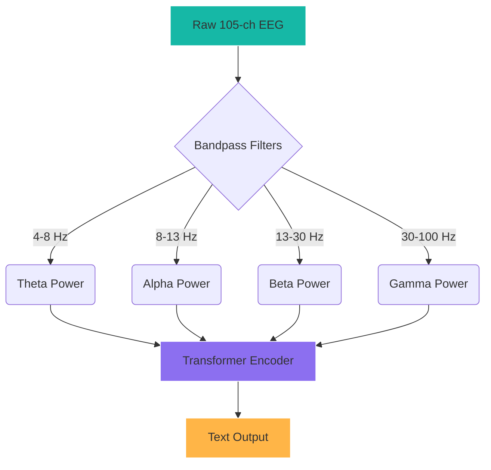
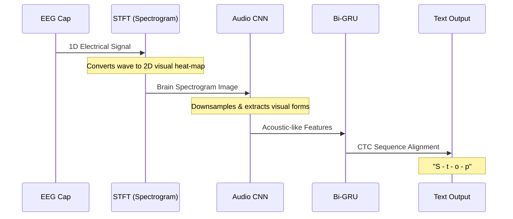

# NeuroLink: Real-Time EEG-to-Text Training Architectural Plan

## 1. Core Intuition & The "Decryption" Problem

The fundamental challenge of translating brain waves (EEG) to text is that EEG signals have a **low signal-to-noise ratio** and are inherently unaligned. When a user thinks of the word "Water", the neural firing pattern might happen exactly at 200ms or slowly build up over 500ms.

We resolve this using **Connectionist Temporal Classification (CTC) Loss**, a method that allows a network to predict text without knowing exactly _when_ the thought occurred within the brain wave recording.

To tackle the feature extraction, we have designed three distinct architectural approaches. Here is a high-level comparison before diving into the details.

### Method Comparison Table

| Approach                           | Methodology                | Primary Input                             | Neural Backbone                   | Best For                                                 |
| :--------------------------------- | :------------------------- | :---------------------------------------- | :-------------------------------- | :------------------------------------------------------- |
| **1. End-to-End Spatial-Temporal** | Deep Learning Discovery    | Raw 105-channel amplitudes (Voltage)      | Conformer / CNN-LSTM              | Discovering unknown neural micro-states.                 |
| **2. NLP Paradigm**                | Manual Feature Engineering | Frequency band powers (Alpha/Beta/Gamma)  | Pure Transformer                  | Interpretable, neuroscientifically grounded translation. |
| **3. Audio Mimicry**               | Cross-domain Transfer      | 2D Pseudo-Spectrograms (Time/Freq images) | Convolutional GRU (Wav2Vec style) | Leveraging existing audio/voice-to-text infrastructure.  |

---

## Approach 1: End-to-End Spatial-Temporal Learning (The Conformer)

### Intuition

Don't rely on humans to guess what brain frequencies matter. Feed the raw 105 channels directly into a deep neural network and let the model figure out which channels (like Broca's area) and which rapid firing patterns correspond to speech. It acts like a digital sponge, soaking up raw voltage and distilling it into intent.

### Example

Imagine a user thinking "Hello". The signal travels from the frontal cortex to the motor cortex. Instead of trying to track this path manually, the **Spatial 1D Convolution** dynamically mixes the signals from electrodes E44 (Broca candidate) and E36 (Motor). The **Conformer blocks** then look at how this mixed signal changes over 50ms windows to output the letter 'H'.

### Pipeline Representation

| Step  | Operation         | Input Shape  | Output Shape | Purpose                                           |
| :---- | :---------------- | :----------- | :----------- | :------------------------------------------------ |
| **1** | Raw Ingestion     | `[105, 500]` | `[105, 500]` | Standardize 105-channel wave limits.              |
| **2** | Spatial Conv      | `[105, 500]` | `[256, 500]` | Mix channels to isolate functional candidates.    |
| **3** | Conformer Block   | `[256, 500]` | `[256, 500]` | Attention (Global) + Convolution (Local context). |
| **4** | Linear Classifier | `[256, 500]` | `[65, 500]`  | Map latent space to 65 character probabilities.   |

### Visualization

---

## Approach 2: Pure Transformer with Manual Feature Extraction (NLP Paradigm)

### Intuition

Treat brain waves like language structure. We know that language processing causes specific rhythmic changes (e.g., Gamma band activity increases during semantic processing). Instead of feeding raw voltage, we manually filter the wave into these specific frequency bands, treating them like grammatical "tokens" or "syntax" that a Transformer can easily read.

### Example

When the user thinks "Move left", the **Gamma band** in the right hemisphere spikes, and the **Mu/Alpha band** in the central motor strip drops. We explicitly calculate these band powers using SciPy and pass exactly 4 numbers per timestep (Gamma, Beta, Alpha, Theta) into the Transformer. The Transformer treats the sudden "Gamma spike" exactly like a verb token in NLP.

### Pipeline Representation

| Step  | Operation         | Input Shape  | Output Shape | Purpose                                              |
| :---- | :---------------- | :----------- | :----------- | :--------------------------------------------------- |
| **1** | Raw Ingestion     | `[105, 500]` | `[105, 500]` | Initial capture.                                     |
| **2** | SciPy Bandpass    | `[105, 500]` | `[420, 500]` | Extract Theta, Alpha, Beta, Gamma power per channel. |
| **3** | Transformer Enc   | `[420, 500]` | `[256, 500]` | Learn relationships between the frequency tokens.    |
| **4** | Linear Classifier | `[256, 500]` | `[65, 500]`  | Predict characters from frequency patterns.          |

### Visualization

---

## Approach 3: Audio Mimicry (Waveform-to-Spectrogram)

### Intuition

Acoustic sound waves and brain waves are both just oscillating signals. State-of-the-art voice models (like Whisper or Wav2Vec 2.0) are incredibly good at "seeing" frequency patterns over time using spectrograms. We can trick these audio models into "hearing" the brain by converting the EEG signals into 2D visual spectrograms and feeding them into an audio architecture.

### Example

The user imagines saying "Stop". We use a Short-Time Fourier Transform (STFT) to turn the 1D brainwave into a 2D heat-map (spectrogram) where the X-axis is time, the Y-axis is frequency, and color is intensity. A deep Convolutional Neural Network looks at this heat-map just like it looks at a voice's pitch and formants, recognizing the visual "shape" of the word "Stop" in the brain frequencies.

### Pipeline Representation

| Step  | Operation              | Input Shape   | Output Shape  | Purpose                                                       |
| :---- | :--------------------- | :------------ | :------------ | :------------------------------------------------------------ |
| **1** | Raw Ingestion          | `[105, 1000]` | `[105, 1000]` | Longer sequence capture.                                      |
| **2** | STFT Transform         | `[105, 1000]` | `[6825, 250]` | Convert 1D time-domain to 2D time-frequency heat-map.         |
| **3** | Audio CNN (Downsample) | `[6825, 250]` | `[512, 62]`   | Shrink the massive image into concentrated acoustic features. |
| **4** | Bi-GRU (Temporal)      | `[512, 62]`   | `[1024, 62]`  | Scan the features sequentially for word structure.            |
| **5** | Linear Classifier      | `[1024, 62]`  | `[65, 62]`    | Output characters.                                            |

### Visualization

